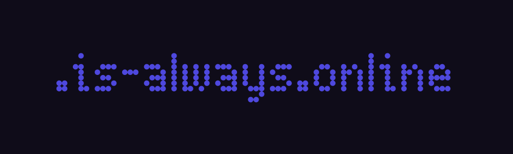

<p align="center">
   
</p>

<p align="center">
   
   
   
</p>

<h1 align="center">is-always.online</h1>

<p align="center"><strong>is-always-online</strong> is a service that allows developers to get ".is-always.online" domain for their websites, api service.</p>

### Discord Server

Make sure to join our Discord server:
https://discord.gg/78Mc4UVqMV

## Issues

If you have any problems, feel free to [open a issue](https://github.com/is-always-online/register/issues/new/choose).

If you have an issue that contains confidental infomation, send an email to security@is-always.online.

## Register

### Manual Registration

- [Fork](https://github.com/is-always-online/register/fork) and star this repository
- Add a new file called `your-domain-name.json` in the `domains` folder to register `your-domain-name.is-always.online`

```json
{
  "description": "Project Description",
  "subdomain": "example",
  "owner": {
    "repo": "https://github.com/username/repo",
    "email": "hello@example.com"
  },
  "record": {
    "A": ["1.1.1.1", "1.0.0.1"],
    "AAAA": ["::1", "::2"],
    "CNAME": "example.com",
    "MX": ["mx1.example.com", "mx2.example.com"],
    "TXT": ["example_verification=1234567890"]
  },

  "proxied": false
}
```

- Your pull request will be reviewed and merged. _Make sure to keep an eye on it incase we need you to make any changes!_
- After the pull request is merged, please allow up to 24 hours for the changes to propagate
- Enjoy your new `.is-always.online` domain!

## Status

You can check the uptime of our services on our [status dashboard](https://status.is-always.online).

### Donate

If you like this project, please consider donating so we can keep this project running forever!

<a href='https://ko-fi.com/K3K0QX2YQ' target='_blank'></a>
